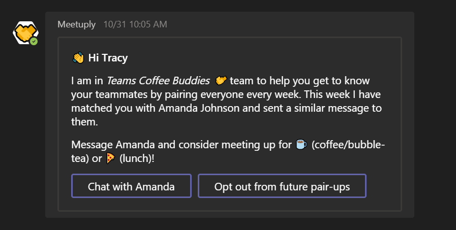

# Meetuply 🤝🤖
Meetuply is an open-source bot for Microsoft Teams that helps the whole team get closer by pairing members up every week at random, to meet for coffee, burgers, pizza, or a walk around the block.

The source for the bot is available under [MIT license](LICENSE) and demonstrates how to accomplish the following common scenarios in your bot:

* How to keep track of which teams your bot has been added to?
* How to retrieve the list of members in a team?
* How to send a message from your bot to a user in a one-on-one chat?
* How to monitor a team for new member additions and welcome each new member personally?
* How to send [Adaptive Cards](https://docs.microsoft.com/en-us/adaptive-cards/getting-started/bots) from your bot?
* How to retrieve information about a team?

# Setting up ⚙

## Getting started
* Clone this repo.
* Open MeetupBot.sln file in Visual Studio.

## Register your Teams app and bot
* Open [App Studio](https://docs.microsoft.com/en-us/microsoftteams/platform/concepts/build-and-test/app-studio-overview) in Teams.
* Go to the Maifest editor and create a new app.
  * You just need to do the App details and Bots tabs.
  * Use the checked in manifest (manifest/Meetuply/manifest.json) as a reference as needed, and use the icons checked in there.
  * In the Bots tab, give your bot Personal and Team Scopes. Have it generate an "App password" and save that along with the bot's ID (these are actually an AAD app ID and secret they've generated for you).
  * At the last step, download your app's zip file!
* Open Web.config file and update it as follows:
  * Replace `ADD_BOT_APP_ID_HERE` and `ADD_BOT_ID_HERE` with the Bot ID (i.e. AAD app ID) you received while registering your bot.
  * Replace `ADD_BOT_APP_SECRET_HERE` with the app password.
* Use the following PowerShell command to create a new Guid: `[guid]::NewGuid()`.
  * Copy this Guid value and paste it into your Web.config for `CHOOSE_A_KEY_HERE`.
  
## Setting up CosmosDB used by the bot to track which teams it has been added to, and which users have opted out
* Go to [Azure Portal](https://portal.azure.com) and register a new Azure Cosmos DB database.
* Choose "Core (SQL)" for API.
* Create a database with name `MeetupBotConfig`
* Create the following collections:
  * `TeamsInstalled` with partition-key as teamId.
  * `UsersOptInStatus` with partition-key as tenantId.
* Copy the Cosmos DB endpoint URL and paste it into Web.config to replace `ADD_COSMOS_DB_ENDPOINT_URL_HERE`.
* Copy the Cosmos DB key value and paste it into Web.config to replace `ADD_COSMOS_DB_KEY_HERE`.

## Publish your bot to Azure
* Publish your bot to an Azure App Service from Visual Studio.
* Paste the URL of the newly created service in the `Messaging endpoint` field in the [Bot Framework Portal](https://dev.botframework.com/bots) configuration for yout bot. Just suffix it with /api/messages.

## Setup the Scheduler job to periodically pair up people
* Open the included TriggerWebJob.sln. Update Program.cs with your app's url and replace `<key>` with the Guid you created above and pasted for `CHOOSE_A_KEY_HERE`. Build, and zip the folder containing the exe (under bin/debug).
* Find your App Service in the Azure Portal and go to the WebJobs tab.
* Create a WebJob to trigger each Monday morning at 10 am (CRON expression: 0 0 18 * * Mon).
* [Enable Always On](https://docs.microsoft.com/en-us/azure/app-service/webjobs-create#webjob-types) on your App Service so that the trigger will work.

## Update the manifest and sideload!
Navigate to the team you want to add this to, go to Manage team, Apps, and Upload a custom app. Use the zip file you downloaded while registering your app!

# Questions ❓ / Issues 🙋‍♂️ / Feedback 🗨
Post [here](https://github.com/siduppal/TeamsMeetuplyBot/issues).

Contributions are welcome! 👏
